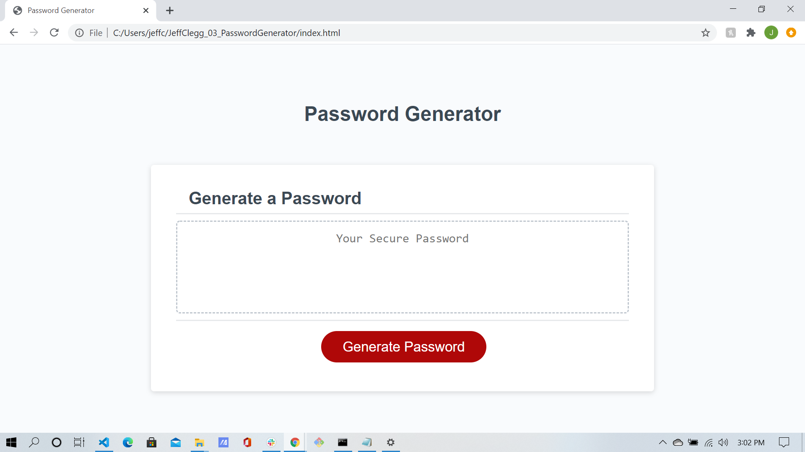
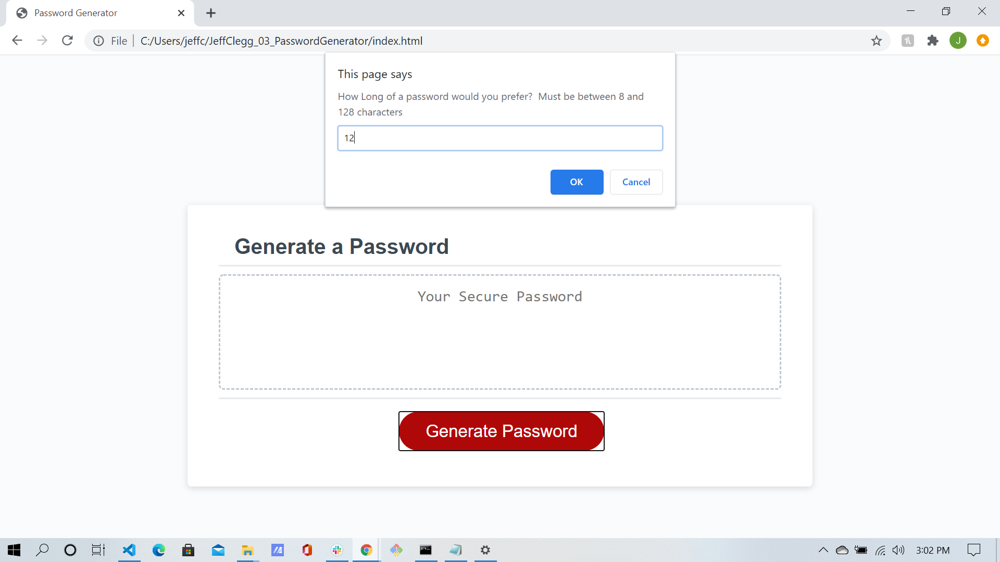
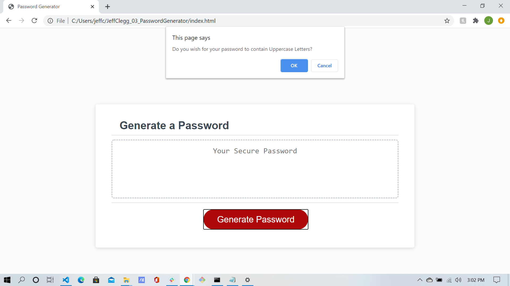
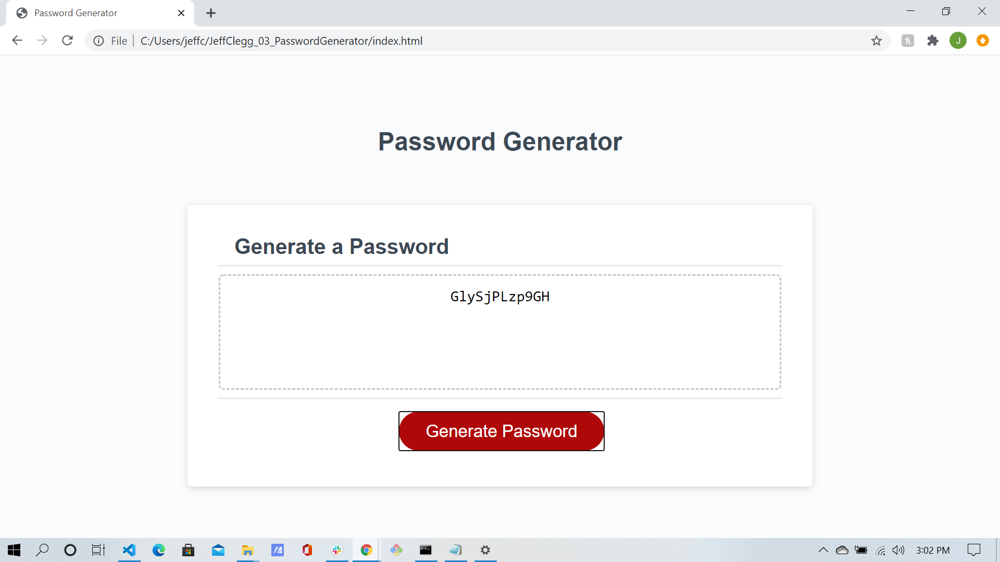

# JeffClegg_03_PasswordGenerator

This project was designed as a homework assignment for MSU's coding bootcamp. 

This application was created to emphasize the use of Javascript and the many ways to generate a random, secure password for the user. 

This project has been deployed to my Personal GitHub Page. To get this project up and running, you can follow the deployment links that I have included in the Link Section below.

## Links

* [GitHub Repository](https://github.com/JC72/JeffClegg_03_PasswordGenerator)
* [Deployed GitHub IO](https://jc72.github.io/JeffClegg_03_PasswordGenerator/) 

### Project Overview
* HTML and CSS and Javascript documents create a random password generator 
* This project emphasizes the use of using Javascript to make dynamic changes to an HMTL document

### This assignment contains the following features: 
* A generate button
    * This will send the user a series of prompts and confirms
    * After user data is collected, a random password will be generated using Javascript

* A Textarea
    * This textarea will display the users password once it is generated

### Project Requirements: 
* The user will be prompted to choose from the following password criteria: 8 and 128 characters
* The user will recieve a confirm for: 
    * Password containing special characters, numbers, and uppercase
    * Either 4 variables individual ones, or 3 with toLowerCase to Uppercase conversion
    * This will need to randomly generate a selection or randomly select array data, so math.random and math.floor will need to be used.     
* The application should validate user input and ensure that at least one character type is selected.
    * If, else if statement 
* Once all prompts are answered, the user will be presented with a password matching the answered prompts. Displaying the generated password in an alert is acceptable, but attempt to write the password to the page instead.
    * Event listener will determine the password output with function to populate the value into the test area.

### This project has scripted features of:
* Variable declaration area 
* An event listener (onclick) called generatePassword
    * This will prompt the user for input between 8-128
    * This variable is changed to an interger using ParseInt()
    * This will validate that the input is a number within range, or is a number
    * This then uses the input to determine the types (or choices) or letters of characters used, using an if statement
    * This then assigns values to the variables using arrays for character, number or alphabet
* Another variable is created to concatenate the above variables
* A for loop will loop through the enter prompt until it reaches the number entered by user. 
* A password variable takes the value from the for loop, and converts it to a string. 
* The string value then populates into the text area for the user. 

### To Execute File:
> Open in browser

### Contains: 
* One HTML Pages
    * Index.html 
        * Contains basic user input items and buttons with divs and ids
* Two CSS Pages
    * Styles.css
        * Contains centering and styling for html user input features
        * Contains media queries
    * Reset.css
        * Resets all styling prior to using the styles.css
* One Javascript Page
        * Contains: 
        * Variables, including arrays and value placeholders
        * Two event listeners
        * Several if/else if statements
        * One function outside of first event listener
        * For Next Loops

## Creators:

* **Jeff Clegg** - [Git Hub Profile](https://github.com/JC72)
* MSU BootCamp

